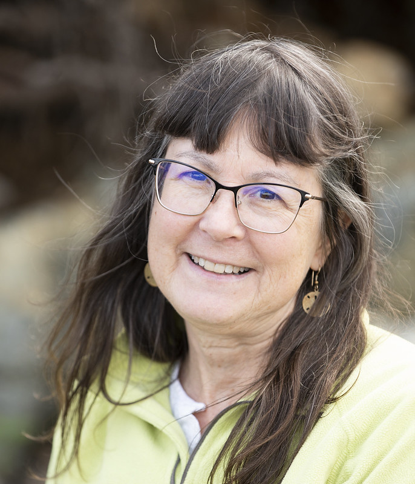
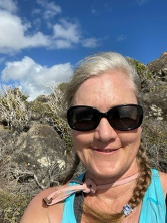

```{r setup, include=FALSE}
knitr::opts_chunk$set(
    echo = FALSE,
    message = FALSE,
    warning = FALSE
)

```
```{css}
d-title {
    display: none;
  }
```
## The Members Of The Community Environmental Health Lab
### Jane Disney, Ph.D. Associate Professor
```{r,echo=FALSE, out.width='50%'}

```

### Hannah Lust

```{r, echo=FALSE, out.width='50%'}
# 
```

### Alexis Garretson

```{r, echo=FALSE, out.width='50%'}
knitr::include_graphics("images/members/Alexis_Garettson.png")
```

### Carrie LeDuc

```{r, echo=FALSE, out.width='50%'}

```

### Cait Bailey

```{r, echo=FALSE, out.width='50%'}
# 
```

### Nathan Dorn

```{r, echo=FALSE, out.width='50%'}
# knitr::include_graphics("images/members/Alexis_Garettson.png")
```

### Sarah Dunbar

## Lab Alumni
