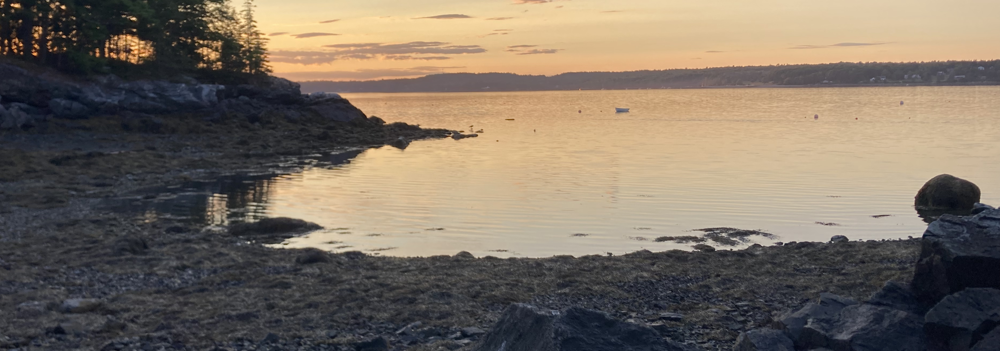

```{r setup, include=FALSE}
knitr::opts_chunk$set(echo = FALSE)
```

```{css}
d-title {
    display: none;
  }
```

```{r,layout="l-screen", echo=FALSE, out.width='100%', out.extra='style="padding:0px"'}

```

## Community Environmental Health Lab at MDIBL

**Dr. Jane E Disney Associate Professor of Environmental Health**

Can engaging students in collecting well water samples for toxic metal analysis and sharing their findings with their communities result in changed behaviors and improved public health? Is this school-based approach more impactful than other types of community interventions? What skills and supports do teachers and students need to realize this outcome? Does engagement with locally relevant issues provide incentive for learning and improve learning outcomes? How do these experiences impact self-efficacy and interest in Science, Technology, Engineering and Math (STEM) careers? These are central questions of the Science Education Partnership Award (SEPA) project.

As an outgrowth of this project, the Community Lab is collaborating with researchers across multiple disciplines to understand seasonality of arsenic and other metals in well water. Heavy metals can contaminate private wells through geogenic sources and surface water seepage and run-off after storm events. People who are exposed to heavy metals via their well water risk acute and chronic toxicity, liver, kidney, and intestinal damage and cancer. Through repeated visits to well owners, we are comparing well water "toxic metal fingerprints" over time and spatial scales and are discovering that every well has its own story. Homeowners may need to know their "well story" to implement the most appropriate mitigation measures to prevent toxic metal exposure and related diseases.

The Community Lab is working with additional collaborators to develop approaches to identifying which well water samples collected by citizen scientists may have negative health impacts on the consumer. Are EPA drinking water standards for individual metals sufficient for determining drinking water safety? Our findings suggest that metal mixtures may need to be taken into consideration. We plan health history follow-ups with well owners to help inform future public health recommendations and actions.

